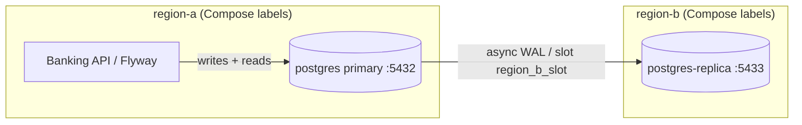

# PostgreSQL Multi-Region Replication (T-101)

Local **asynchronous streaming replication**: a write primary in `region-a` ships WAL to a hot standby in `region-b`. This is a topology simulator on Docker Compose, not production HA.

**Not in this task**

| Concern | Task |
|---------|------|
| Automatic failover / promotion | T-102 |
| PITR / S3 backup | T-103 |
| App read-replica routing (analytics) | T-104 |

The Banking API and Flyway keep using the **primary** (`localhost:5432`). The replica (`localhost:5433`) is read-only.

---

## Why async (not sync) for multi-region

Synchronous commit waits for a replica flush before the primary returns success. Across regions that adds tens of milliseconds (or worse) to every `COMMIT` — including ledger inserts.

This demo uses **async** streaming:

- **RPO:** seconds of WAL not yet replayed (not zero). Measure with `replay_lag` on `pg_stat_replication`.
- **RTO:** time to promote a replica — **T-102**, not automated here.
- Primary stays writable if the replica is down (WAL slots retain segments until the replica catches up; monitor disk).

---

## Local topology



| Role | Compose service | Host port | `pg_is_in_recovery()` |
|------|-----------------|-----------|------------------------|
| Primary | `postgres` | 5432 | `f` |
| Hot standby | `postgres-replica` | 5433 | `t` |

---

## Run locally

Default `docker-compose.dev.yml` is unchanged (single Postgres). Enable the replica with the overlay:

```bash
docker compose -f docker/docker-compose.dev.yml \
  -f docker/docker-compose.replication.yml \
  --profile replication up -d

./scripts/postgres/verify-replication.sh
```

The verify runner checks recovery state, that a primary insert appears on the replica, that replica writes fail, and that `pg_stat_replication` lists slot `region_b_slot`.

Inspect lag yourself:

```bash
docker compose -f docker/docker-compose.dev.yml \
  -f docker/docker-compose.replication.yml \
  --profile replication exec postgres \
  psql -U banking_user -d banking_api \
  -c "SELECT application_name, client_addr, state, replay_lag FROM pg_stat_replication;"
```

Stop the replica without touching the rest of the stack:

```bash
docker compose -f docker/docker-compose.dev.yml \
  -f docker/docker-compose.replication.yml \
  --profile replication stop postgres-replica
```

If the primary volume was created **before** this overlay, Compose recreates the primary container (command + `hba_file` change) but keeps data. The replica entrypoint creates the `replicator` role and physical slot if they are missing. A full reset is `down -v` (destroys local DB data).

---

## How it is wired

1. Overlay sets primary `wal_level=replica`, WAL senders/slots, and `hba_file` with `host replication replicator`.
2. Init script `docker/postgres/replication/00-replication.sh` runs on **empty** primary volumes only.
3. `postgres-replica` waits for `pg_isready`, ensures the replication role + slot on the primary, then `pg_basebackup -R --slot=region_b_slot`.
4. Replica starts with `hot_standby=on` (read-only queries allowed).

Placeholders (not production secrets) live in `.env.example`: `POSTGRES_REPLICATION_USER` / `POSTGRES_REPLICATION_PASSWORD` / `POSTGRES_REPLICATION_SLOT`.

---

## Kubernetes / production mapping

The T-100 StatefulSet is a **single primary** (`spec.replicas: 1`). Scaling that field does **not** create streaming replicas — it starts independent Postgres instances.

| Local demo | Production intent |
|------------|-------------------|
| Compose primary + replica | Managed: RDS Multi-AZ (+ optional cross-region read replica), Cloud SQL HA, or CloudNativePG / Patroni |
| Labels `region-a` / `region-b` | Separate regions / availability zones |
| Slot `region_b_slot` | Operator-managed replication slots |
| App → `:5432` | Writer endpoint only until T-104 |

Do not point Flyway or money flows at the replica.

---

## Safety

- Local Docker Compose only — do not point this overlay at staging or production clusters.
- A replica is not a backup (see T-103). WAL streaming does not replace `pg_dump` / PITR.
- No automatic failover. Promoting a standby is T-102.
- Passwords in `.env.example` are placeholders. Never commit real credentials.
